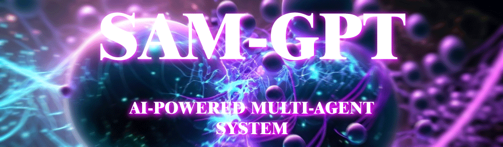

<p align="center">

</p>


Welcome to SAM-GPT an AI-powered multi-agent system! This project aims to help users streamline processes and automate repetitive tasks using a combination of NLP and multi-agent systems. We've designed a modular and scalable architecture that allows for easy extensibility and adaptability. Feel free to explore the code, contribute, or leave some feedback!

(This is a project in progress. It is not production-ready.)

<p></p>
<p></p>

## 🌟 Upcoming Features
---
* Natural Language Processing (NLP) using OpenAI API and LangChain
* Autonomous task generation and delegation
* Command Line Interface (CLI) for user interaction
* Plan generation using state-of-the-art AI models
* Modular and scalable multi-agent design
* Vector embeddings for agent communication, collaboration and memory
* Continuous and approval modes for safer user control

## 🛠 Installation
---
1. Clone the repository:

```bash
git clone https://github.com/PriNova/SAM-GPT.git
cd SAM-GPT
```	
2. Create a virtual environment and install the dependencies:

```bash
python3 -m venv venv
source venv/bin/activate
pip3 install -r requirements.txt
```
3. Set up your API keys and other configuration settings in a .env file or as environment variables.

4. Run the application:

```bash
python3 samgpt.py
```

## 📚 Usage
---
The application supports a command-line interface for interacting with the multi-agent system. Run the app and follow the prompts to input your goals and manage tasks.

## 📖 Documentation
---
 The general project structure, use-cases, and roadmap can be found [here](/documentation/index.md).

 You can find detailed documentation for the functions, classes, and modules in the source code docstrings.
 
 We follow the Google Python Style Guide for docstring formatting.

📈 Contributing
---
We love contributions! If you're interested in helping out, here's what you can do:

1. Fork the repository and create your branch (`git checkout -b feature/YourFeature`).
2. Commit your changes (`git commit -m 'Add some feature').
3. Push to the branch (`git push origin feature/YourFeature`).
4. Open a Pull Request.

Please follow the [Code of Conduct](/documentation/CODE_OF_CONDUCT.md) when contributing to this project.

Feel free to open an issue or submit a pull request for bug fixes, new features, or other improvements. We appreciate your support!

## 📜 License
---
This project is MIT licensed.

## 🤝 Contact
---
If you have any questions, feel free to reach out to us!

Discussion: [Discussions](https://github.com/PriNova/SAM-GPT/discussions)

Issues: [Issue](https://github.com/PriNova/SAM-GPT/issues)
