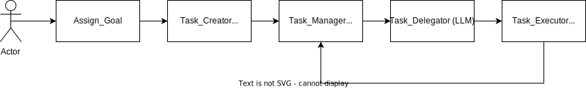

<h1 align="center">WORKFLOW</h1>

This is the actual work flow of the application:

1. The user enters the goal via CLI.
2. A plan is generated by the [Plan Generator](../samgpt/planning/plan_generation.py).
3. The Task_Manager takes the first task and passes it to the Task Delegate.
4. The Task_Delegator selects the appropriate command to execute.
5. The Task_Executor executes the command. The result is returned to the Task_Manager.

[<- back](index.md)